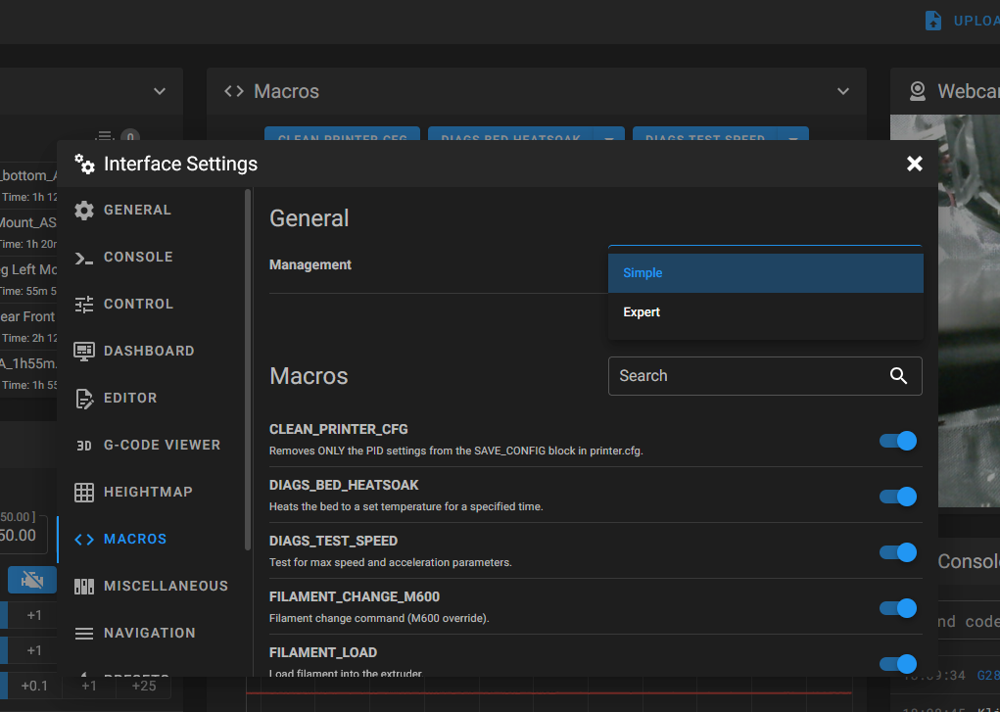
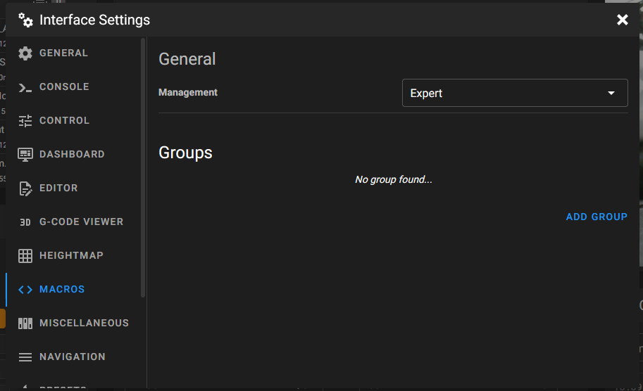
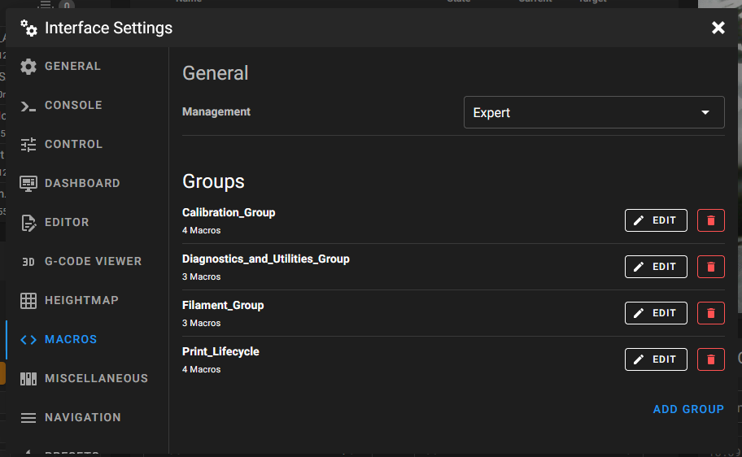

# Organizing Macros in Mainsail

You can organize your list of macros into clean, logical groups. Mainsail has a feature that lets you create separate sections for your macros directly from the user interface.

---

## 1. Enable Expert Mode for Macros

First, switch Mainsail's macro display from **Simple** to **Expert** mode:

1. In the Mainsail interface, click the **Settings** icon (the gear ⚙️) in the top right menu.
2. In the menu on the left, go to the **Macros** section.
3. Change the **Mode** from "Simple" to "Expert."

---

## 2. Create Your Macro Groups

Once in Expert Mode, you'll see a new **Create Group** button. You can create groups that act as headings for your macros. Based on your current macros, I suggest the following groups:

- Print Lifecycle
- Filament
- Calibration
- Diagnostics & Utilities

Click **Create Group** for each of these and give them a name.

---

## 3. Add Macros to Your New Groups

After creating the groups, add your macros to them:

1. Click the pencil icon ✏️ next to a group to edit it.
2. From the "Available Macros" list, select the macros that belong in that group.

### Recommended Macro Sorting

#### Print Lifecycle
- PRINT START
- PRINT END
- SET PAUSE AT LAYER
- SET PAUSE NEXT LAYER

#### Filament
- FILAMENT CHANGE M600
- FILAMENT LOAD
- FILAMENT UNLOAD

#### Calibration
- RUN_BED_MESH
- VORON PURGE
- LOAD PID PROFILE
- SAVE PID TO PROFILE

#### Diagnostics & Utilities
- CLEAN PRINTER CFG
- DIAGS BED HEATSOAK
- DIAGS TEST SPEED

---

Once you save your changes, your Mainsail dashboard will update with a much cleaner, organized layout for your